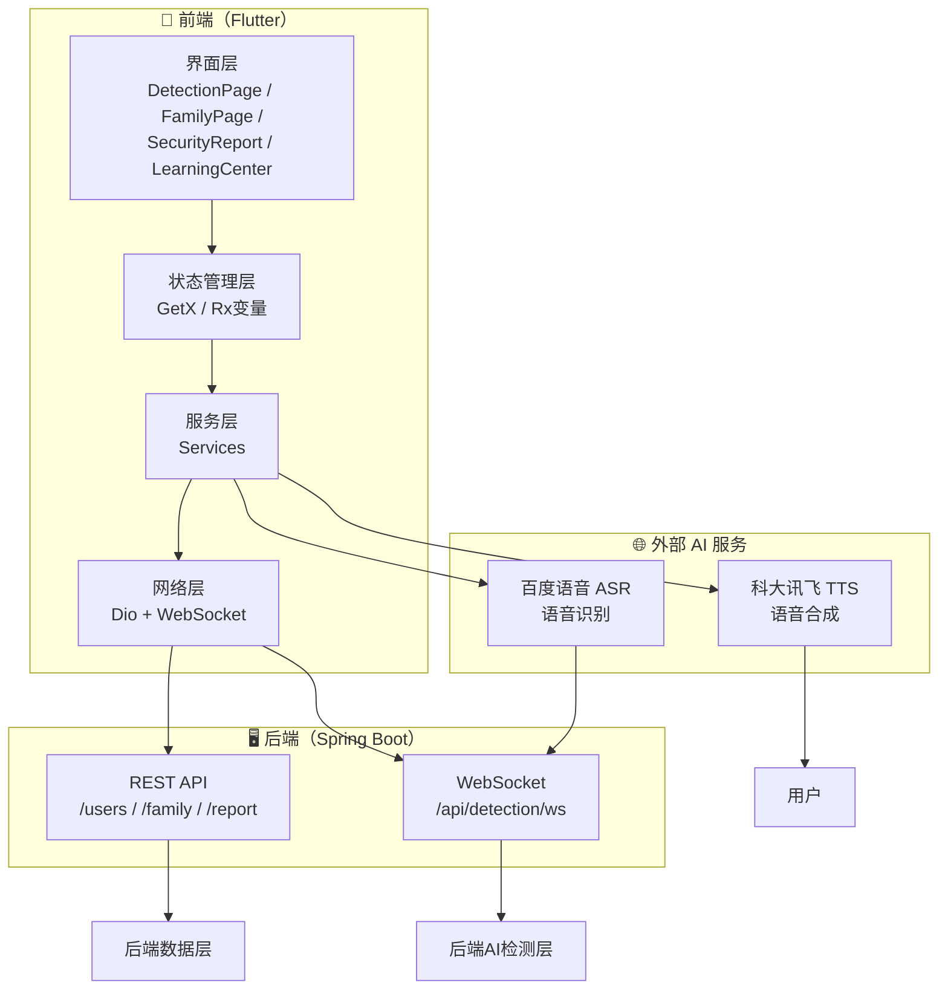
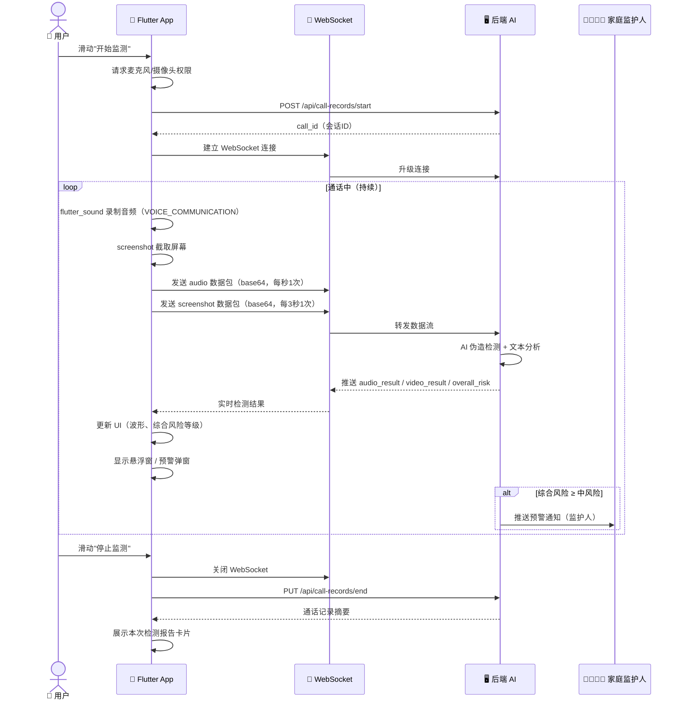
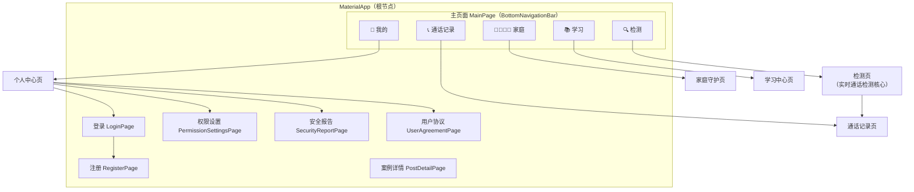
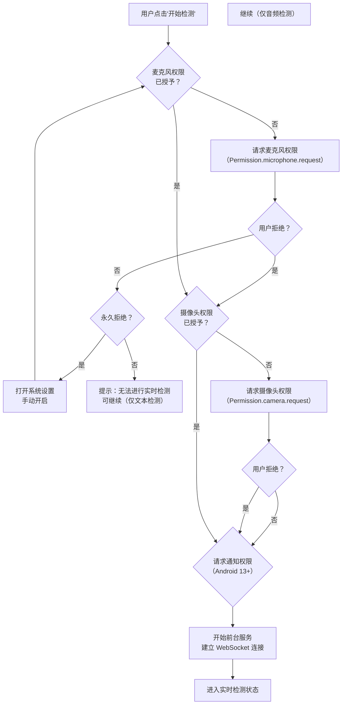

# AI 反诈检测系统 · 前端设计说明书

> 撰写人：前端组
> 日期：2026-04-07

---

## 1 前端技术栈概述

本项目前端基于 **Flutter 3.43.0**（Dart 3.12.0）跨平台框架开发，主要运行在 Android 真机上，采用赛博朋克（Cyberpunk）深色主题——以深灰黑（`#25282B`）为底色，以荧光黄绿（`#CDED63`）和荧光黄（`#EFFF86`）作为高亮强调色，营造科技感与警示感。整体技术选型遵循三大原则：① 优先选用成熟稳定的社区方案；② 状态管理、网络通信、AI 服务各层严格解耦；③ 所有外部 API 均封装为 Service 单例，页面层零直接依赖。

### 1.1 核心框架与底层语言

Flutter 是 Google 推出的跨平台 UI 框架，以**一套代码覆盖 Android / iOS / macOS / Windows**，同时保留接近原生的性能与原生能力。本项目核心场景为实时通话检测，涉及麦克风音频采集、WebSocket 双向通信、悬浮窗渲染、前台保活等深度系统能力，Flutter 自研 Skia 图形引擎可稳定输出 60fps 高帧率渲染，相比 React Native 的 JS Bridge、uni-app 的 WebView 等方案，在实时性和原生集成上具有明显优势。

#### 1.1.1 Flutter 版本与平台约束

| 版本项 | 值 |
|--------|------|
| Flutter SDK | 3.43.0（master channel latest，开发版）|
| Dart | 3.12.0，启用空安全（sound null safety）|
| Android minSdkVersion | 21（Android 5.0，覆盖率 99%+）|
| Android targetSdkVersion | 34（Android 14）|
| iOS 最低版本 | iOS 12.0 |

> 注：master channel 可跟进 Dart 最新特性（如 structured concurrency 预览版），生产发布时应切换至 stable 分支。

#### 1.1.2 主要竞品对比

| 方案 | 渲染模式 | 性能 | 原生能力 | 热重载 | 学习成本 |
|------|---------|------|---------|--------|---------|
| **Flutter** | 自研 Skia | 高 | 强（MethodChannel）| 毫秒级 | 中等（Dart）|
| React Native | JS Bridge | 中 | 中（第三方桥接）| 秒级 | 较高（JS/TS）|
| uni-app | WebView / NVUE | 低~中 | 弱（受限）| 秒级 | 低（Vue）|
| Kotlin/Swift 原生 | 原生渲染 | 最高 | 最强 | 无 | 高（双端各自维护）|

### 1.2 工程化与构建工具

工程化层面，项目以 `flutter pub` 管理依赖，基于 Gradle 构建 Android APK，遵循 `flutter_lints`（Effective Dart）代码规范，提交前强制执行 `dart format` 格式化与 `dart analyze` 静态分析，确保零警告。Git 分支策略采用 `master` 主分支稳定可发布，功能开发在 `feature/` 分支进行，禁止直接修改 `pubspec.lock`。多环境切换通过 `contants/` 目录下的配置文件实现——`index.dart` 对接生产服务器，`index(自用版).dart` 对接本地 `localhost`，`index(内网穿透版).dart` 对接穿透后的公网域名，切换时仅需在 `main.dart` 顶部修改 import 或通过 `--dart-define=ENV=xxx` 编译标签指定，无需改动任何业务代码。

#### 1.2.1 架构分层原则

| 层级 | 目录 | 职责 | 依赖关系 |
|------|------|------|---------|
| 表现层 | `pages/` | 页面 UI，调用 Service | 仅依赖 Service |
| 业务逻辑层 | `services/` | 核心逻辑封装 | 依赖 Utils、API |
| 状态管理层 | `stores/`、`viewmodels/` | GetX 响应式状态 | 依赖 Service |
| 网络层 | `utils/`、`api/` | Dio 封装、接口定义 | 无业务依赖 |
| 配置层 | `contants/` | 主题色、全局常量、多环境 | 仅被依赖 |

**依赖方向严格单向：配置层 → 网络层 → 业务逻辑层 → 表现层，禁止逆向依赖。**

### 1.3 样式与 UI 方案

UI 层以 Flutter 丰富的 Material / Cupertino 组件库为基础，结合项目自研的赛博朋克主题色板（`theme.dart`），统一管理颜色、字体、阴影等视觉规范。核心 UI 依赖包括：`fl_chart` 实现报告数据可视化、`flutter_markdown` 渲染安全报告富文本、`video_player` 播放案例学习视频、`carousel_slider` 实现轮播图展示、`table_calendar` 提供通话记录日历视图、`convex_bottom_bar` 构建底部 Tab 导航、`action_slider` 实现检测启停的防误触滑动控件。针对老年人用户群，APP 全局支持老年人模式——`MaterialApp.builder` 自动注入 `textScaler = 1.25×`（最大 `1.6×`），所有页面字号按比例放大，无需用户手动干预。

#### 1.3.1 UI 依赖包一览

| 依赖包 | 版本 | 用途 |
|--------|------|------|
| flutter_markdown | ^0.7.4 | 安全报告 Markdown 渲染 |
| fl_chart | ^0.68.0 | 报告数据可视化图表 |
| video_player | ^2.8.0 | 案例学习视频播放 |
| carousel_slider | ^5.1.2 | 轮播图展示 |
| table_calendar | ^3.2.0 | 通话记录日历视图 |
| convex_bottom_bar | ^3.2.0 | 主页面底部 Tab 导航 |
| action_slider | ^0.7.0 | 检测启停防误触滑动控件 |
| screenshot | ^3.0.0 | 通话期间的屏幕截图 |

### 1.4 网络通信与数据处理

网络通信层是前后端数据交互的核心枢纽，选用 **Dio** 作为 HTTP 客户端（相比原生 `http` 包支持拦截器、日志、FormData 上传、自定义超时与重试），配合 **web_socket_channel** 实现 WebSocket 双向实时通信，两者共同构成系统双重通信通道：HTTP REST 承载登录注册、用户信息、家庭组管理、安全报告等低频有状态的请求-响应操作；WebSocket 专司实时通话检测——音频片段（每次约 1 秒，base64 编码）以每秒 1 次的频率上传后端 AI 检测层，检测结果（伪造概率、文本风险、综合等级）以毫秒级延迟实时推送回前端。项目中封装了统一的 `DioRequest` 单例，通过拦截器统一注入 JWT Token、处理 401 跳转登录，并通过 `TokenManager` 实现 Token 自动刷新；`RealTimeDetectionService` 管理 WebSocket 生命周期，与后端 `/api/detection/ws` 端点对接，每次通话对应唯一的 `call_id`。

#### 1.4.1 网络与通信依赖一览

| 依赖包 | 版本 | 用途 |
|--------|------|------|
| dio | ^5.9.1 | HTTP REST API 调用，含拦截器、Token 自动刷新 |
| web_socket_channel | ^2.4.0 | WebSocket 双向连接，实时检测数据流 |
| shared_preferences | ^2.5.4 | 本地 Token 与配置持久化 |
| path_provider | ^2.1.5 | 录音文件本地缓存目录 |
| flutter_local_notifications | ^17.2.3 | 系统推送通知 |
| permission_handler | ^12.0.1 | 麦克风/摄像头等运行时权限 |

#### 1.4.2 双重通信通道对比

| 通道 | 技术 | 适用场景 | 特点 |
|------|------|---------|------|
| HTTP REST | Dio | 登录注册、用户信息、家庭组、安全报告、案例推荐 | 请求-响应模式，适合低频操作 |
| WebSocket | web_socket_channel | 实时通话检测（音频流上传 + 检测结果推送）| 双向流式，低延迟，适合高频实时场景 |

---

## 2 前端项目结构

### 2.1 项目目录结构

项目采用标准 Flutter 分层架构，所有代码文件集中在 `lib/` 目录下：

```
lib/
├── main.dart                           # 应用入口
├── routes/index.dart                   # 路由 + 老年人模式 builder
├── api/                                # API 接口层
│   ├── auth_api.dart                   # 认证相关接口
│   └── system_api.dart                 # 系统接口
├── pages/                              # 页面层（UI）
│   ├── Main/index.dart                 # 主页面（底部 Tab 容器）
│   ├── Login/index.dart                # 登录页
│   ├── Register/index.dart             # 注册页
│   ├── Detection/index.dart            # 实时检测页（核心，3310行）
│   ├── CallRecords/index.dart          # 通话记录页
│   ├── Family/index.dart               # 家庭守护页
│   ├── LearningCenter/                 # 学习中心
│   │   ├── index.dart
│   │   └── PostDetailPage.dart         # 案例详情
│   ├── SecurityReport/index.dart       # 安全报告页
│   ├── Profile/index.dart               # 个人中心
│   ├── UserAgreement/index.dart         # 用户协议
│   └── Settings/PermissionSettings.dart # 权限设置页
├── services/                           # 业务服务层（核心逻辑）
│   ├── auth_service.dart               # 认证服务
│   ├── RealTimeDetectionService.dart   # WebSocket 实时检测核心
│   ├── CallDetectionService.dart       # 通话检测
│   ├── AudioRecordingService.dart       # 音频录制
│   ├── floating_window_service.dart    # 悬浮窗服务
│   ├── alert_popup_service.dart        # 预警弹窗服务
│   ├── tts_service.dart                # 科大讯飞 TTS
│   ├── baidu_speech_service.dart       # 百度语音识别
│   ├── security_report_service.dart    # 安全报告服务
│   ├── family_service.dart             # 家庭组服务
│   ├── foreground_task_handler.dart    # 前台任务管理
│   └── local_notification_service.dart # 本地通知
├── stores/                             # 状态管理层
│   └── user_store.dart                 # 用户状态（GetX）
├── viewmodels/                         # 数据模型层
│   └── login_models.dart               # 登录数据模型
├── utils/                              # 工具层
│   ├── DioRequest.dart                 # Dio 请求封装
│   ├── TokenManager.dart               # Token 管理
│   ├── PermissionManager.dart           # 权限管理器
│   ├── LoadingDialog.dart              # 全局加载弹窗
│   ├── ToastUtils.dart                 # Toast 工具
│   └── report_speech_text.dart         # 报告文本 TTS 转换
└── contants/                           # 常量配置层
    ├── theme.dart                      # 赛博朋克主题色/字体/阴影
    ├── index.dart                      # 全局常量 & API 地址
    ├── index(自用版).dart              # 自用版配置
    └── index(内网穿透版).dart          # 内网穿透配置
```

### 2.2 核心模块说明

| 模块 | 层级 | 说明 |
|------|------|------|
| `pages/` | 表现层 | 44 个 Dart 文件，按页面组织，Detection 页最复杂（3310 行）|
| `services/` | 业务逻辑层 | 12 个 Service，管理所有业务逻辑，含 WebSocket、TTS、ASR、通知等 |
| `stores/` + `viewmodels/` | 状态管理层 | GetX 驱动响应式状态，含用户信息、实时数据等 |
| `utils/` | 工具层 | 网络请求封装、权限管理、Token 刷新、弹窗等基础设施 |
| `api/` | 接口层 | 按模块拆分的 API 调用，封装 Dio 请求 |
| `contants/` | 配置层 | 主题色板、全局常量、多环境配置（自用版 / 内网穿透版）|

**分层原则**：上层依赖下层，下层不感知上层，通过 GetX 依赖注入实现解耦。

---

## 3 数据交互

### 3.1 数据交互设计方案

#### 3.1.1 双重通信通道架构

本系统同时使用 **HTTP REST** 和 **WebSocket** 两种通信方式，各自承担不同职责：

| 通道 | 技术 | 适用场景 | 特点 |
|------|------|---------|------|
| HTTP REST | Dio | 登录注册、用户信息、家庭组管理、安全报告、案例推荐 | 请求-响应模式，有连接开销，适合低频操作 |
| WebSocket | web_socket_channel | 实时通话检测（音频流上传 + 检测结果推送）| 双向流式，低延迟，适合高频实时场景 |



#### 3.1.2 语音能力

| 能力 | 服务商 | 说明 |
|------|--------|------|
| 语音合成（TTS）| 科大讯飞 WebSocket API | 将安全报告文本转为语音朗读，支持语速/音色配置 |
| 语音识别（ASR）| 百度语音识别 | 将通话音频转文字后做文本风险分析 |
| 音频录制 | Flutter Sound（VOICE_COMMUNICATION）| 录制系统通话音频，绕过 Android 10+ 隐私限制 |

### 3.2 HTTP REST 接口

项目中封装了统一的 `DioRequest` 单例，统一注入 Base URL、请求头、超时时间（常规请求 60s，安全报告生成 3min），通过拦截器实现 Token 自动刷新与 401 跳转登录逻辑。

HTTP 接口覆盖用户认证、家庭组管理、通话记录、安全报告生成、案例学习推荐等核心业务。认证模块支持邮箱验证码登录与注册流程；家庭组模块提供组的创建、成员申请与审批、SOS 紧急求救等能力；通话记录模块负责每次检测会话的开始与结束；教育学习模块根据用户角色类型返回个性化防骗案例推荐；安全报告模块调用 LLM 生成用户专属的多维度风险分析报告。接口遵循 RESTful 风格，采用 JWT Token 鉴权，无状态设计便于水平扩展。

### 3.3 WebSocket 实时检测接口

实时通话检测要求毫秒级延迟响应，选用 WebSocket 而非 HTTP 轮询——全双工通信允许音频片段到达即解析，结果实时推送，无需反复建立连接。WebSocket 连接在用户滑动"开始监测"时建立，滑动"停止"时主动关闭，每次通话对应唯一的 `call_id`。

连接地址为 `ws://shuode.nat100.top/api/detection/ws/{user_id}/{call_id}?token={jwt_token}`，消息格式统一采用 JSON，结构为 `{ "type": "消息类型", ... }`。

**上行（客户端 → 服务端）**：通话期间，前端同时采集并发送三条数据流——音频流、视频流、文字流，三者相互独立、并行上传。

| 消息类型 | 数据格式 | 来源 | 频率 |
|---------|---------|------|------|
| `audio` | WAV（PCM 16kHz 单声道，44字节标准头，base64 编码）| 本机麦克风录制（VOICE_COMMUNICATION）| 每秒 1 次（约 32KB）|
| `video` | JPEG 图像，base64 编码 | 屏幕截图 | 动态帧率：安全5fps / 警戒15fps / 高危30fps |
| `text` | UTF-8 纯文本字符串 | 百度语音实时识别结果（FIN_TEXT）| 识别到完整语句时发送 |
| `heartbeat` | 心跳保活 | 客户端自动发送 | 每 30 秒 1 次 |

其中 `audio` 消息额外携带元数据字段 `sample_rate`（固定 16000）、`channels`（固定 1）、`encoding`（固定 wav）、`duration_ms`（本帧时长）；`video` 消息不携带额外字段；`text` 消息的 `data` 字段为纯文本而非 base64。

**下行（服务端 → 客户端）**：服务端在推理完成后推送检测结果，并以独立消息类型区分不同通知场景。

| 消息类型 | data 字段 | 说明 |
|---------|----------|------|
| `ack` | `{ msg_type, status, timestamp }` | 服务端确认收到某条上行消息，status=ready 表示已投递检测 |
| `heartbeat_ack` | - | 心跳响应 |
| `detection_result` | `{ overall_score, voice_confidence, video_confidence, text_confidence, is_fraud, advice, keywords }` | 综合检测结果，四个置信度为 0~1 浮点，`is_fraud` 为布尔诈骗判定 |
| `control` | `{ action, target_level, reason, config }` | 后端下发防御等级升级指令，客户端据此调整帧率 |
| `alert` | `{ title, message, risk_level, confidence, display_mode }` | 风险预警弹窗，`risk_level` 枚举为 medium / high / critical |
| `family_alert` | `{ title, message, risk_level, victim_name, victim_phone }` | 监护人收到：被监护人遭遇风险 |
| `sos_alert` | `{ title, message, victim_name, urgency }` | 监护人收到：用户主动求助 |
| `emergency_alert` | `{ title, message, alert_type, victim_name }` | 监护人收到：用户触发紧急报警 |
| `remote_control` | `{ action, from_admin_name, control: { ui_message, block_call, warning_mode } }` | 被监护人收到：监护人远程干预指令 |
| `environment_detected` | `{ description }` | 后端 OCR 识别通话环境场景（如微信、QQ、电话等） |
| `error` | `{ message }` | 服务端错误 |
| `status` | `{ message }` | 服务端状态更新 |

通话期间，客户端以每秒 1 次的频率上传音频片段、动态帧率上传屏幕截图，并在百度语音识别出完整语句后即时发送文字内容；服务端实时返回多维度置信度与综合风险等级，通过心跳维持连接，断线时前端自动尝试重连，重连失败超过阈值后提示用户手动重启检测。

### 3.4 实时检测数据交互时序图



---

## 4 界面设计

### 4.1 页面架构

应用采用**底部 Tab 导航 + 命名路由**的双层导航架构：



**路由规则**：

- `/` → `MainPage`（已登录默认页，默认显示检测 Tab）
- `/login` → `LoginPage`
- `/register` → `RegisterPage`
- `/permission-settings` → `PermissionSettingsPage`
- `/security-report` → `SecurityReportPage`
- `/user-agreement` → `UserAgreementPage`

> **老年人模式自动路由适配**：当用户 `role_type` 为"老人"时，`MaterialApp.builder` 自动注入 `textScaler = 1.25×`，最大不超过 `1.6×`，无需用户手动设置，所有页面均自动放大。

### 4.2 核心页面说明

| 页面 | 文件路径 | 核心功能 |
|------|---------|---------|
| **检测页** | `pages/Detection/index.dart`（3310行）| 实时通话检测主界面，滑动控件启停，实时波形，三级防御弹窗 |
| **通话记录页** | `pages/CallRecords/index.dart` | 历史通话记录列表，按日期分组，含风险等级标签 |
| **家庭守护页** | `pages/Family/index.dart`（2500+行）| 家庭组管理，成员列表，SOS 求救，远程挂断，申请审批 |
| **学习中心页** | `pages/LearningCenter/index.dart` | 诈骗案例库 + 防骗标语库，角色个性化推荐 |
| **安全报告页** | `pages/SecurityReport/index.dart` | LLM 生成个性化安全报告，Markdown 渲染，TTS 朗读 |
| **个人中心页** | `pages/Profile/index.dart` | 用户信息展示，老年人模式开关，权限管理，退出登录 |
| **登录/注册页** | `pages/Login/index.dart` / `pages/Register/index.dart` | 邮箱验证码登录，支持角色类型选择（老人/学生/青壮年）|

### 4.3 UI 设计规范

#### 4.3.1 赛博朋克色板

| 用途 | 颜色名称 | 色值 | 示例 |
|------|---------|------|------|
| 主色调 | 荧光黄绿 | `#CDED63` | 按钮高亮、Tab 选中 |
| 强调色 | 荧光黄 | `#EFFF86` | 警告文字、风险提示 |
| 辅助色 | 深墨绿 | `#095943` | 卡片边框、次要控件 |
| 背景色 | 深灰黑 | `#25282B` | 全局背景 |
| 卡片色 | 深灰 | `#2F3337` | 卡片/输入框背景 |
| 文字主色 | 米白色 | `#F6F6EF` | 正文文字 |
| 成功色 | 中性绿 | `#9DC24F` | 安全状态指示 |
| 危险色 | 荧光红 | `#FF6B6B` | 高风险/严重风险状态 |

#### 4.3.2 字体规范

| 级别 | 字号 | 用途 |
|------|------|------|
| 正文 | 14pt | 常规说明文字 |
| 副标题 | 16pt | 列表标题 |
| 大标题 | 20pt | 页面主标题 |
| 超大标题 | 24pt | 检测状态文字 |
| 报告标题 | 28pt | 安全报告页标题 |

> 老年人模式下，所有字号乘 `1.25`（最大 `1.6`）系数。

#### 4.3.3 间距与圆角

- 小间距：`8dp`（元素内部）
- 中间距：`16dp`（组件之间）
- 大间距：`24dp`（区块之间）
- 卡片圆角：`12dp`
- 按钮圆角：`12dp`
- 输入框圆角：`12dp`

#### 4.3.4 风险等级 UI 规范

| 风险等级 | 颜色 | 图标 | 状态描述 |
|---------|------|------|---------|
| 安全 Safe | `#9DC24F` 绿色 | ✅ 盾牌 | "实时守护中" |
| 低风险 Low | `#CDED63` 荧光黄绿 | ⚠️ 感叹号 | "存在轻微风险" |
| 中风险 Medium | `#EFFF86` 荧光黄 | ⚠️ 感叹号 | "请提高警惕" |
| 高风险 High | `#FF9800` 橙色 | 🚨 警报 | "高度可疑通话" |
| 严重风险 Critical | `#FF6B6B` 红色 | 🔴 红色感叹号 | "疑似诈骗，请立即终止通话！" |

### 4.4 创新交互设计

#### 4.4.1 滑动启停控件（防误触）

检测页采用 `action_slider` 滑动控件，用户必须从左滑到右并等待动画完成后才触发检测/停止，有效防止口袋/包内误触启动监测。

#### 4.4.2 三级防御渐进提示

```
低风险 → 页面顶部横幅提示（米字闪烁 + 文字警告）
中风险 → 全屏半透明弹窗（自动朗读警告内容，可滑过）
高风险 → 全屏遮罩弹窗（文字警告 + 一键挂断按钮，不可滑过）
```

#### 4.4.3 实时音频波形动画

通话监测期间，底部实时展示 50 采样点的动态音频波形，通过 `AnimationController` 每帧更新，颜色随风险等级变化（绿→黄→红）。

#### 4.4.4 Android 悬浮窗与前台服务

- **前台服务**：`flutter_foreground_task` 维持后台进程，通知栏常驻展示"正在检测中"状态
- **悬浮窗**：`floating_window_service` 在通话期间叠加显示当前风险等级，支持用户不看手机也能感知状态变化

---

## 5 权限管理

### 5.1 权限清单

| 权限 | Android 权限名 | 用途 | 触发时机 |
|------|--------------|------|---------|
| 麦克风 | `RECORD_AUDIO` | 录制通话双方音频 | 用户点击"开始检测"时请求 |
| 摄像头 | `CAMERA` | 录制视频通话画面 | 用户点击"开始检测"时请求 |
| 通知 | `POST_NOTIFICATIONS` | 接收风险预警系统通知 | App 首次冷启动时请求（Android 13+）|
| 录屏 | `MediaProjection` | 截取通话期间屏幕 | 开始检测时通过 API 动态请求（无需声明权限）|
| 前台服务 | `FOREGROUND_SERVICE` | 后台持续检测 | Android 9+ 自动授权（清单声明即可）|
| 存储 | `READ/WRITE_EXTERNAL_STORAGE` | 截图/报告文件存取 | 仅 Android 10 以下需要 |

### 5.2 权限请求流程



### 5.3 权限管理模块设计

权限管理由 `PermissionManager` 单例统一封装，提供以下能力：

```dart
class PermissionManager {
  // 响应式权限状态（GetX）
  final RxBool hasMicrophonePermission = false.obs;
  final RxBool hasCameraPermission = false.obs;
  final RxBool hasScreenRecordPermission = false.obs;
  final RxBool hasForegroundServicePermission = false.obs;

  /// 检查所有权限当前状态
  Future<void> checkAllPermissions() async

  /// 一键请求所有必需权限（麦克风必须，摄像头可选）
  Future<bool> requestAllPermissions(BuildContext context) async

  /// 请求单个权限并返回结果
  Future<PermissionStatus> requestPermission(Permission permission) async

  /// 跳转到系统设置页面（永久拒绝时引导用户手动开启）
  Future<bool> openSettings() async
}
```

**设计原则**：

- 麦克风权限为**必需**，拒绝则无法启动实时检测
- 摄像头权限为**可选**，拒绝后降级为纯音频检测模式
- 永久拒绝时弹出引导对话框，提供"去设置"跳转按钮
- Android 13+ 单独请求通知权限，未授权时风险预警仍通过 App 内弹窗展示
- 权限状态在 App 生命周期内缓存在内存中，避免重复请求

### 5.4 特殊权限处理

#### 5.4.1 Android 10+ 通话音频录制

Android 10 之后禁止通过麦克风录制通话双方的混合音频。本项目采用 **`VOICE_COMMUNICATION`** 音频源，通过 `AudioSource` 参数指定：

```dart
await recorder.startRecorder(
  codec: Codec.pcm16bits,
  sampleRate: 16000,
  numChannels: 1,
  audioSource: AudioSource.voiceCommunication, // 关键：录制通话音频
);
```

此方案在部分国产定制 ROM（如华为、小米）上可能需要额外申请"通话录音"权限，应用商店上架时需注意隐私政策合规。

#### 5.4.2 前台服务与电池优化

- 使用 `flutter_foreground_task` 在通知栏注册前台服务
- 请求 `REQUEST_IGNORE_BATTERY_OPTIMIZATIONS` 避免被系统省电策略杀死
- 检测结束后立即调用 `FlutterForegroundTask.stopService()` 释放资源

#### 5.4.3 悬浮窗权限（Android 6.0+）

悬浮窗属于特殊权限（`SYSTEM_ALERT_WINDOW`），无法通过 `permission_handler` 静默申请，必须跳转系统设置页面引导用户手动开启：

```dart
// 跳转到悬浮窗权限设置页面
await PermissionManager().openSystemAlertWindowSettings();
```

---
