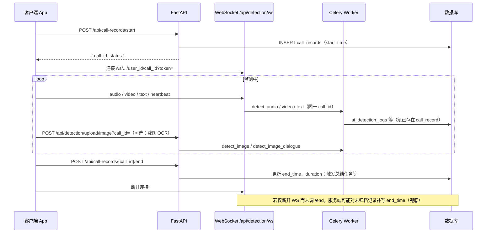

# 实时监测与通话记录（CallRecord）全流程接口说明

本文档描述客户端开启**一次实时监测会话**时，与后端交互的推荐顺序、接口定义及数据落库关系。  
原则：**一次监测会话 = 一条 `call_records` 记录**；检测明细写入 `ai_detection_logs`、`chat_messages`；会话结束时写入 **`end_time` / `duration`**。

---

## 1. 认证

除 WebSocket 使用查询参数传递 Token 外，其余 HTTP 接口均需在请求头携带 JWT：

```http
Authorization: Bearer <access_token>
```

WebSocket URL 使用查询参数：`?token=<access_token>`（与登录接口返回的 access token 一致）。

---

## 2. 端到端流程概览



---

## 3. 创建通话记录（会话开始）

客户端在开始推流/截图前**必须先**创建记录，后续所有检测与上传**必须使用同一 `call_id`**。

| 项目 | 说明 |
|------|------|
| 方法 / 路径 | `POST /api/call-records/start` |
| Content-Type | `application/x-www-form-urlencoded` 或兼容查询参数（以实际路由为准；当前实现为**查询参数**） |

### 查询参数

| 参数 | 类型 | 必填 | 说明 |
|------|------|------|------|
| `platform` | string | 是 | 通话平台枚举，须与后端一致：**小写** `phone` \| `wechat` \| `qq` \| `video_call` \| `other`。非法值会落为 `other`。 |
| `target_identifier` | string | 是 | 电话场景填号码；微信/QQ 等可填对方昵称或占位（如 `realtime_detection`）。 |

### 响应示例

```json
{
  "call_id": 42,
  "status": "started"
}
```

### 数据库行为

- 写入表 `call_records`：`start_time`、初始 `platform`、`caller_number` 或 `target_name`（按平台）、`detected_result` 默认安全等。
- **`call_id` 由数据库自增生成**，客户端需保存并在整段监测内复用。

---

## 4. WebSocket 实时检测

| 项目 | 说明 |
|------|------|
| URL | `ws://<HOST>:<PORT>/api/detection/ws/{user_id}/{call_id}?token=<JWT>` |
| 说明 | `user_id` 须与 Token 中 `sub` 一致；`call_id` 须为上一节返回的 ID。 |

### 4.1 客户端 → 服务端（JSON 文本帧）

| `type` | `data` | 说明 |
|--------|--------|------|
| `audio` | Base64 等音频载荷 | 投递 `detect_audio_task` |
| `video` | 视频帧 batch | 攒帧满批后投递 `detect_video_task` |
| `text` | 字符串或 `{ "text": "..." }` | 投递 `detect_text_task` |
| `heartbeat` | 可空 | 服务端返回 `heartbeat_ack` |
| `control` | 如 `{ "action": "set_config", "fps": 5 }` | 防御等级/采集配置等 |

### 4.2 服务端 → 客户端（常见）

| `type` | 说明 |
|--------|------|
| `ack` | 音频/视频/文本已接收 |
| `heartbeat_ack` | 心跳响应 |
| `detection_result` | 综合检测分数（`data` 内含各模态置信度等） |
| `control` | 如防御升级 `upgrade_level` |
| `environment_detected` | 截图环境分类经 Redis 推送后的前端展示（若接入） |

### 4.3 与通话记录的关系

- WebSocket 上的 `call_id` 会原样传入 Celery；**检测任务只更新已存在的 `call_record`**，不会在任务内新建通话记录。
- 连接**正常断开或异常**时，若该通话尚未写入 `end_time`，服务端可能**补写** `end_time`/`duration`（兜底）；仍建议客户端在停止监测时**显式调用**结束接口（见第 6 节）。

---

## 5. 截图 OCR（环境分类 / 聊天提取）

用于补充「界面环境」与聊天文字检测，**必须携带与当前会话一致的 `call_id`**。

| 项目 | 说明 |
|------|------|
| 方法 / 路径 | `POST /api/detection/upload/image` |
| Content-Type | `multipart/form-data`（字段 `file`） |

### 查询参数（必填）

| 参数 | 类型 | 必填 | 说明 |
|------|------|------|------|
| `call_id` | int | **是** | 与 `POST /call-records/start` 返回的 `call_id` 一致。缺失会导致 Celery 中 `call_id` 为空，环境感知无法关联会话。 |
| `dialogue_only` | bool | 否，默认 `false` | `false`：环境分类（`detect_image`）；`true`：仅增量聊天 OCR（`detect_image_dialogue`）。 |

### 响应 `data` 示例字段

- `url`、`filename`、`size`：上传 MinIO 后的信息  
- `task_id`：Celery 任务 id  
- `dialogue_only`：是否与请求一致  

---

## 6. 结束监测（归档通话）

| 项目 | 说明 |
|------|------|
| 方法 / 路径 | `POST /api/call-records/{call_id}/end` |
| 认证 | Bearer JWT（路径中的 `call_id` 须属于当前用户） |

### 请求体（JSON，均可选）

| 字段 | 类型 | 说明 |
|------|------|------|
| `audio_url` | string | 完整录音地址 |
| `video_url` | string | 完整录像地址 |
| `cover_image` | string | 封面图地址 |

### 服务端行为摘要

1. 校验通话归属。  
2. 写入 **`end_time`**，计算 **`duration`（秒）**（基于 `start_time`）。  
3. 按需更新 `audio_url` / `video_url` / `cover_image`。  
4. 异步触发 **`generate_post_call_summary`**（通话总结等）。  
5. 持久化 Redis 中的对话等到库、清理部分融合引擎缓存。  

### 响应

统一包装为项目的 `ResponseModel`（`code`、`message`、`data` 等，以实际返回为准）。

---

## 7. 查询与列表（可选）

| 方法 | 路径 | 说明 |
|------|------|------|
| GET | `/api/call-records/my-records` | 当前用户通话列表（分页等） |
| GET | `/api/call-records/record/{call_id}` | 单条详情（含 `start_time`、`end_time`、`duration` 等） |
| DELETE | `/api/call-records/record/{call_id}` | 删除自己的记录 |

---

## 8. 数据表分工（概念）

| 表 / 模块 | 作用 |
|-----------|------|
| `call_records` | **一条会话一行**：起止时间、时长、平台、汇总结论字段等 |
| `ai_detection_logs` | 各次音频/视频/文本/图片检测日志 |
| `chat_messages` | 结构化对话流水 |
| Redis（短期） | 对话上下文、实时置信度黑板等 |

---

## 9. 前端集成检查清单

1. 调 `POST /api/call-records/start` 并保存 **`call_id`**。  
2. WebSocket URL 使用 **同一 `call_id`**。  
3. `POST /api/detection/upload/image` **必须**带 **`call_id` 查询参数**。  
4. 停止监测时调用 **`POST /api/call-records/{call_id}/end`**，再断开 WebSocket（顺序可与现有 App 一致；服务端亦有断开兜底）。  
5. `platform` 传参使用 **小写枚举**（如 `wechat`），与后端 `CallPlatform` 一致，避免被归为 `other`。  

---

## 10. 错误与排错

| 现象 | 可能原因 |
|------|----------|
| Celery 日志中 `call_id=None` | 上传截图未传 `call_id` 查询参数。 |
| 检测任务提示 `call_record_not_found` | 未先 `start` 或 `call_id`/`user_id` 与库中不一致。 |
| 无 `end_time` | 未调 `/end` 且连接未触发服务端兜底；或 Token/权限导致 `/end` 失败。 |

---

## 11. 版本与路径说明

- 路由前缀以部署的 FastAPI 应用为准（常见为 `/api/call-records`、`/api/detection`）。  
- 若使用 HTTPS，WebSocket 一般为 `wss://`。  
- 具体 `HOST`、`PORT` 由部署环境（如 `main.py` / 环境变量）决定。

文档生成依据仓库内 `app/api/call_records.py`、`app/api/detection.py` 及检测任务实现；若代码变更，请以源码为准并同步更新本文档。
